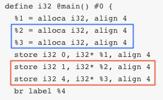
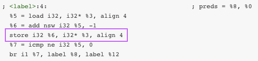
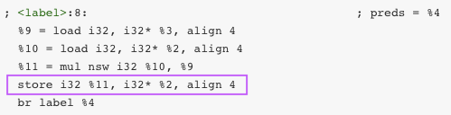

王智楷 MG1933064
-------------------------------
# 原始代码

```c++
int main(){
    int i = 1;
    int j = 4;
    while(j--){
        i *= j;
    }
    return 0;
}
```

# 转换后的代码

``` xml
; ModuleID = 'test.cpp'
source_filename = "test.cpp"
target datalayout = "e-m:o-i64:64-f80:128-n8:16:32:64-S128"
target triple = "x86_64-apple-macosx10.15.0"

; Function Attrs: noinline norecurse nounwind optnone ssp uwtable
define i32 @main() #0 {
  %1 = alloca i32, align 4
  %2 = alloca i32, align 4
  %3 = alloca i32, align 4
  store i32 0, i32* %1, align 4
  store i32 1, i32* %2, align 4
  store i32 4, i32* %3, align 4
  br label %4

; <label>:4:                                      ; preds = %8, %0
  %5 = load i32, i32* %3, align 4
  %6 = add nsw i32 %5, -1
  store i32 %6, i32* %3, align 4
  %7 = icmp ne i32 %5, 0
  br i1 %7, label %8, label %12

; <label>:8:                                      ; preds = %4
  %9 = load i32, i32* %3, align 4
  %10 = load i32, i32* %2, align 4
  %11 = mul nsw i32 %10, %9
  store i32 %11, i32* %2, align 4
  br label %4

; <label>:12:                                     ; preds = %4
  ret i32 0
}

attributes #0 = { noinline norecurse nounwind optnone ssp uwtable "correctly-rounded-divide-sqrt-fp-math"="false" "darwin-stkchk-strong-link" "disable-tail-calls"="false" "less-precise-fpmad"="false" "min-legal-vector-width"="0" "no-frame-pointer-elim"="true" "no-frame-pointer-elim-non-leaf" "no-infs-fp-math"="false" "no-jump-tables"="false" "no-nans-fp-math"="false" "no-signed-zeros-fp-math"="false" "no-trapping-math"="false" "probe-stack"="___chkstk_darwin" "stack-protector-buffer-size"="8" "target-cpu"="penryn" "target-features"="+cx16,+fxsr,+mmx,+sahf,+sse,+sse2,+sse3,+sse4.1,+ssse3,+x87" "unsafe-fp-math"="false" "use-soft-float"="false" }

!llvm.module.flags = !{!0, !1, !2}
!llvm.ident = !{!3}

!0 = !{i32 2, !"SDK Version", [2 x i32] [i32 10, i32 15]}
!1 = !{i32 1, !"wchar_size", i32 4}
!2 = !{i32 7, !"PIC Level", i32 2}
!3 = !{!"Apple clang version 11.0.0 (clang-1100.0.33.8)"}
```

# 说明



### 声明

define: `%2` 和 `%3` 在蓝框处被第一次声明

### 第一次赋值

define: `%2` 和 `%3` 在红框处被第一次赋值

### 第二次赋值



label 4: `%3` 在紫框处被第二次赋值



label 8: `%2` 在紫框处被第二次赋值

# 总结

因为 `%2` 和 `%3` 第二次赋值改变了第一次赋值时内存位置的值，因此没有做到赋值后内存位置不变

